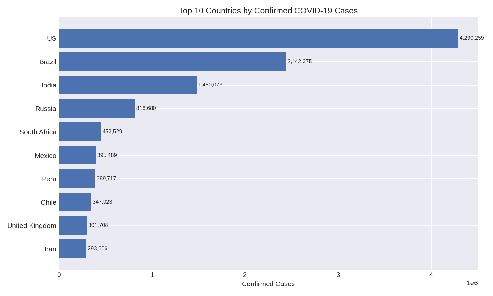

# COVID-19 Global Data Analysis

A simple Python data analysis project exploring COVID-19 cases, deaths, recoveries, population, and testing data across countries.

## 📊 What I Did

- Cleaned and merged COVID-19 datasets
- Analyzed cases, deaths, and recoveries
- Calculated useful metrics
- Compared countries and continents
- Created charts to visualize the results

## 🛠️ Tools Used

- Python
- Pandas
- NumPy
- Matplotlib

## 📈 Key Analysis

- Total COVID-19 cases by country
- Deaths and recoveries
- Case Fatality Rate
- Cases per 1M population
- Testing intensity
- Country and continent comparisons

## 📊 Sample Output



The project also generates charts for:

- Cases by continent
- Deaths by WHO region
- Case Fatality Rate vs Recovery Rate
- Testing vs Reported Cases

## 🎯 Key Insights

- The US, Brazil, and India have the largest shares of confirmed cases in the dataset.
- The global case fatality rate is **3.97%**.
- The global recovery rate is **57.45%**.
- Countries with higher testing levels tend to report more cases per capita.

## 📁 Project Structure

```text
covid-data-analysis-python/
│
├── data/
├── output/
├── data_cleaning.py
├── analysis.py
├── requirements.txt
└── README.md
```

## 🚀 How to Run

```bash
git clone https://github.com/DANSWRANG-09/covid-data-analysis-python.git
cd covid-data-analysis-python
pip install -r requirements.txt
python analysis.py
```

## 👨‍💻 Author

**Danswrang Narzary**

GitHub: https://github.com/DANSWRANG-09

## 📄 License

MIT  [LICENSE]License
